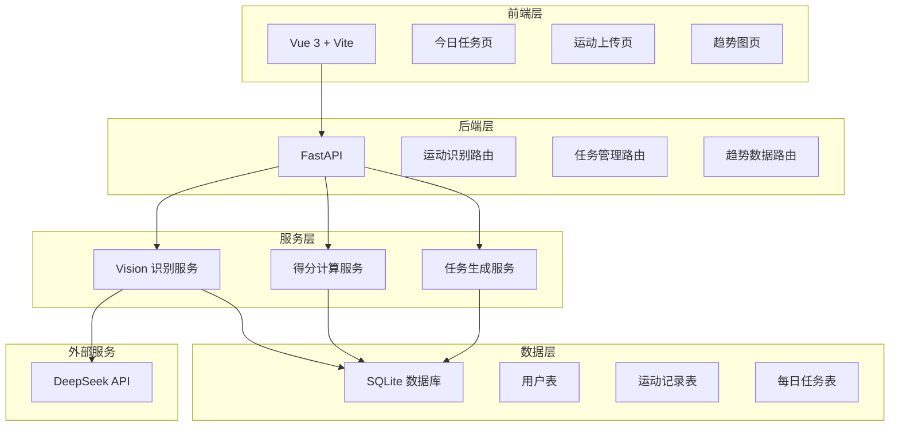
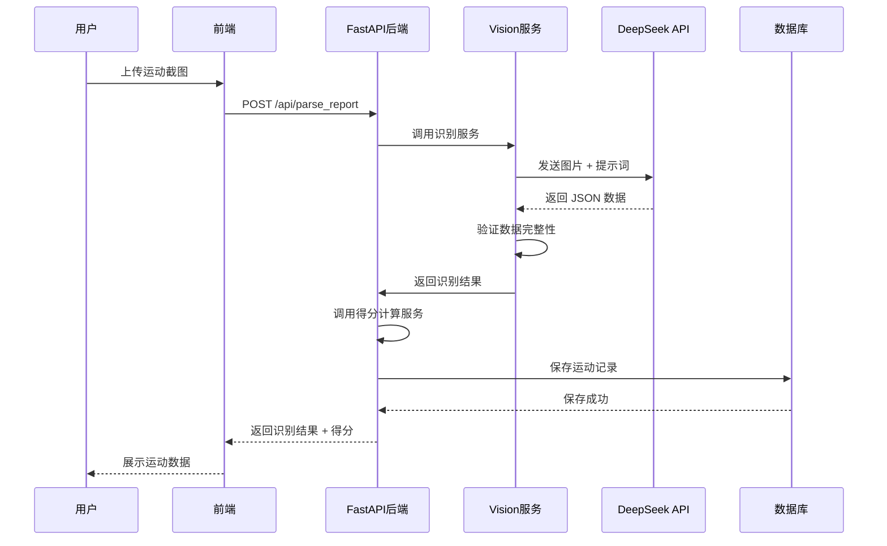
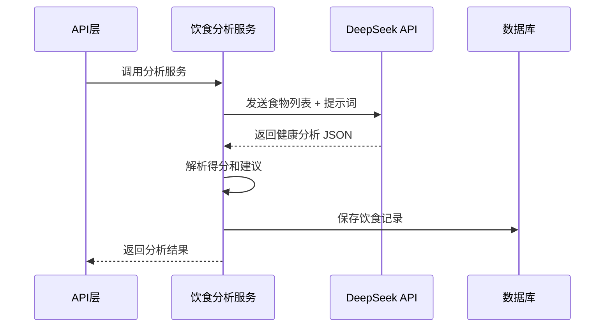
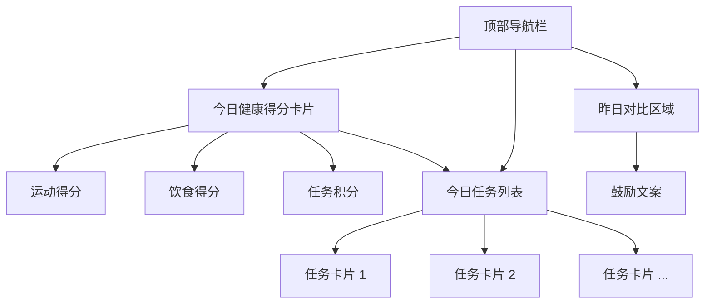
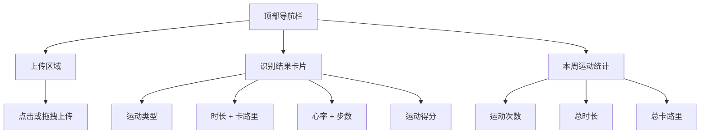
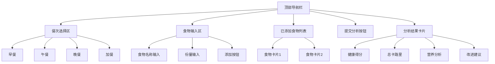
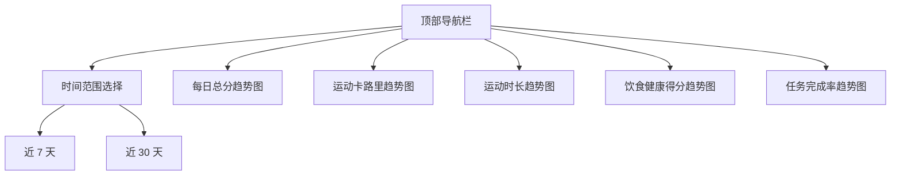
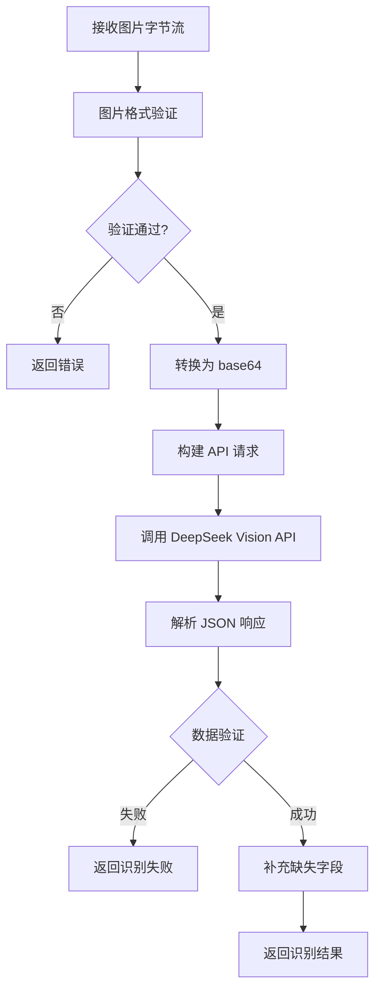

# 家庭健康助手 FamilyFit - 系统设计文档

## 一、项目概述

### 1.1 项目目标
构建一款简单易用的健康管理应用,通过智能识别运动截图、每日健康任务打卡、健康趋势可视化三大核心功能,帮助用户养成良好的健康习惯。

### 1.2 核心价值
- **简化数据录入**: 通过 AI 视觉识别自动解析运动数据,避免手动输入
- **习惯养成**: 通过每日任务系统和积分激励机制,培养健康生活习惯
- **可视化反馈**: 通过趋势图直观展示健康改善情况,增强用户成就感

### 1.3 目标用户
面向所有希望改善健康状况的用户群体,包括但不限于:
- 使用智能手表或健康 App 记录运动数据的用户
- 希望通过简单方式管理健康数据的用户
- 需要健康指导和正向反馈的用户

### 1.4 核心功能
1. **运动记录识别**: 上传华为/Apple 设备运动截图,自动提取数据并生成得分
2. **饮食记录评分**: 记录每日饮食,AI 自动分析营养健康度并生成饮食得分
3. **每日健康任务**: 系统生成简单健康任务(喝水、拉伸、散步等),完成后积分奖励
4. **健康趋势展示**: 可视化展示每日得分、运动趋势、任务完成度、饮食健康度

## 二、系统架构设计

### 2.1 技术架构



### 2.2 前端技术栈
- **框架**: Vue 3 (Composition API)
- **构建工具**: Vite
- **UI 设计**: 简单卡片式布局,适配移动端
- **图表库**: Chart.js 或 ECharts
- **HTTP 客户端**: Axios

### 2.3 后端技术栈
- **框架**: FastAPI
- **Python 版本**: 3.10+
- **数据库**: SQLite
- **ORM**: SQLModel 或 SQLAlchemy
- **AI 服务**: DeepSeek API (Vision 模型)

### 2.4 部署方式
- 响应式 Web 应用,通过浏览器访问
- 移动端优先设计,支持桌面浏览器

## 三、数据模型设计

### 3.1 用户表 (User)

| 字段名 | 类型 | 说明 | 约束 |
|--------|------|------|------|
| id | Integer | 用户唯一标识 | 主键,自增 |
| name | String | 用户姓名 | 非空,最大长度 50 |
| role | String | 用户角色标识 | 可选值: father/mother/other,默认 other |
| created_at | DateTime | 创建时间 | 自动生成 |

**说明**: role 字段保留但不限制使用场景,可用于家庭成员区分或忽略

### 3.2 运动记录表 (ExerciseRecord)

| 字段名 | 类型 | 说明 | 约束 |
|--------|------|------|------|
| id | Integer | 记录唯一标识 | 主键,自增 |
| user_id | Integer | 所属用户 | 外键,关联 User.id |
| exercise_type | String | 运动类型 | 如: 跑步、骑行、羽毛球等 |
| duration_min | Integer | 运动时长(分钟) | 非负整数 |
| calories | Integer | 消耗卡路里 | 非负整数 |
| steps | Integer | 步数 | 可为空,非负整数 |
| avg_heart_rate | Integer | 平均心率 | 可为空,非负整数 |
| max_heart_rate | Integer | 最大心率 | 可为空,非负整数 |
| source_device | String | 来源设备 | apple/huawei/unknown |
| date | Date | 运动日期 | 非空 |
| score | Integer | 运动得分 | 0-100 |
| created_at | DateTime | 记录创建时间 | 自动生成 |

**索引设计**:
- user_id + date: 用于查询用户某日运动记录
- user_id + created_at: 用于趋势查询

### 3.3 饮食记录表 (MealRecord)

| 字段名 | 类型 | 说明 | 约束 |
|--------|------|------|------|
| id | Integer | 记录唯一标识 | 主键,自增 |
| user_id | Integer | 所属用户 | 外键,关联 User.id |
| meal_type | String | 餐次类型 | breakfast/lunch/dinner/snack |
| food_items | Text | 食物列表(JSON 格式) | 非空 |
| total_calories | Integer | 总卡路里 | 可为空,非负整数 |
| health_score | Integer | 健康得分 | 0-100 |
| analysis | Text | AI 健康分析 | 可为空 |
| date | Date | 用餐日期 | 非空 |
| created_at | DateTime | 记录创建时间 | 自动生成 |

**food_items 字段格式**:
```
[
  {"name": "白米饭", "amount": "1碗"},
  {"name": "西兰花", "amount": "100g"},
  {"name": "鸡胸肉", "amount": "150g"}
]
```

**索引设计**:
- user_id + date: 用于查询用户某日饮食记录
- user_id + date + meal_type: 用于查询具体餐次

### 3.4 每日任务表 (DailyTask)

| 字段名 | 类型 | 说明 | 约束 |
|--------|------|------|------|
| id | Integer | 任务唯一标识 | 主键,自增 |
| user_id | Integer | 所属用户 | 外键,关联 User.id |
| task_name | String | 任务名称 | 如: 喝 8 杯水、拉伸 10 分钟 |
| task_type | String | 任务类型 | water/stretch/walk/diet/no_sugar |
| done | Boolean | 是否完成 | 默认 false |
| date | Date | 任务日期 | 非空 |
| reward_points | Integer | 奖励积分 | 默认 10 |
| created_at | DateTime | 创建时间 | 自动生成 |

**索引设计**:
- user_id + date: 用于查询用户当日任务
- user_id + date + done: 用于统计完成率

## 四、API 接口设计

### 4.1 运动识别接口

**接口**: POST /api/parse_report

**功能**: 上传运动截图,通过 Vision 模型识别数据,计算得分并存储

**请求格式**:
- Content-Type: multipart/form-data
- 参数:

| 参数名 | 类型 | 说明 | 必填 |
|--------|------|------|------|
| file | File | 运动截图文件 | 是 |
| user_id | Integer | 用户 ID | 是 |

**响应格式** (JSON):

```
{
  "success": true,
  "data": {
    "exercise_type": "跑步",
    "duration_min": 30,
    "calories": 220,
    "steps": 5340,
    "avg_heart_rate": 120,
    "max_heart_rate": 150,
    "score": 78,
    "source_device": "huawei",
    "date": "2024-01-15"
  },
  "message": "识别成功"
}
```

**异常响应**:
- 400: 文件格式不支持
- 422: 识别失败或数据不完整
- 500: 服务器错误

### 4.2 获取今日任务接口

**接口**: GET /api/tasks/today

**功能**: 获取指定用户当日的所有任务

**请求参数**:

| 参数名 | 类型 | 说明 | 必填 |
|--------|------|------|------|
| user_id | Integer | 用户 ID | 是 |

**响应格式** (JSON):

```
{
  "success": true,
  "data": {
    "date": "2024-01-15",
    "tasks": [
      {
        "id": 1,
        "task_name": "喝 8 杯水",
        "task_type": "water",
        "done": false,
        "reward_points": 10
      },
      {
        "id": 2,
        "task_name": "拉伸 10 分钟",
        "task_type": "stretch",
        "done": true,
        "reward_points": 10
      }
    ],
    "total_tasks": 5,
    "completed_tasks": 1,
    "total_points": 10
  }
}
```

### 4.3 完成任务接口

**接口**: POST /api/tasks/done

**功能**: 标记某个任务为已完成

**请求格式** (JSON):

```
{
  "task_id": 1,
  "user_id": 1
}
```

**响应格式** (JSON):

```
{
  "success": true,
  "data": {
    "task_id": 1,
    "done": true,
    "reward_points": 10,
    "total_points_today": 20
  },
  "message": "任务完成,获得 10 积分"
}
```

### 4.4 添加饮食记录接口

**接口**: POST /api/meals/add

**功能**: 添加一餐的饮食记录,AI 自动分析健康度并评分

**请求格式** (JSON):

```
{
  "user_id": 1,
  "meal_type": "lunch",
  "food_items": [
    {"name": "白米饭", "amount": "1碗"},
    {"name": "西兰花", "amount": "100g"},
    {"name": "可乐", "amount": "500ml"}
  ],
  "date": "2024-01-15"
}
```

**响应格式** (JSON):

```
{
  "success": true,
  "data": {
    "id": 1,
    "meal_type": "lunch",
    "health_score": 72,
    "total_calories": 650,
    "analysis": "本餐营养较均衡,有主食、蔬菜和蛋白质。建议: 减少含糖饮料摄入,可用白开水或无糖茶代替可乐。"
  },
  "message": "饮食记录成功"
}
```

**异常响应**:
- 400: 食物列表为空
- 422: meal_type 不合法
- 500: AI 分析失败

### 4.5 获取今日饮食记录接口

**接口**: GET /api/meals/today

**功能**: 获取用户当日的所有饮食记录

**请求参数**:

| 参数名 | 类型 | 说明 | 必填 |
|--------|------|------|------|
| user_id | Integer | 用户 ID | 是 |

**响应格式** (JSON):

```
{
  "success": true,
  "data": {
    "date": "2024-01-15",
    "meals": [
      {
        "id": 1,
        "meal_type": "breakfast",
        "food_items": [{"name": "牛奶", "amount": "250ml"}, {"name": "全麦面包", "amount": "2片"}],
        "health_score": 85,
        "total_calories": 320,
        "analysis": "早餐营养均衡,富含蛋白质和碳水化合物。"
      },
      {
        "id": 2,
        "meal_type": "lunch",
        "food_items": [{"name": "白米饭", "amount": "1碗"}, {"name": "西兰花", "amount": "100g"}],
        "health_score": 72,
        "total_calories": 650,
        "analysis": "本餐营养较均衡..."
      }
    ],
    "total_calories": 970,
    "avg_health_score": 78,
    "meal_count": 2
  }
}
```

### 4.6 获取健康趋势接口

**接口**: GET /api/trends

**功能**: 获取用户的健康数据趋势(最近 7 天或 30 天)

**请求参数**:

| 参数名 | 类型 | 说明 | 必填 | 默认值 |
|--------|------|------|------|--------|
| user_id | Integer | 用户 ID | 是 | - |
| days | Integer | 查询天数 | 否 | 7 |

**响应格式** (JSON):

```
{
  "success": true,
  "data": {
    "daily_scores": [
      {"date": "2024-01-09", "score": 65},
      {"date": "2024-01-10", "score": 72},
      {"date": "2024-01-11", "score": 58},
      {"date": "2024-01-12", "score": 80},
      {"date": "2024-01-13", "score": 75},
      {"date": "2024-01-14", "score": 88},
      {"date": "2024-01-15", "score": 90}
    ],
    "exercise_trends": {
      "calories": [180, 220, 150, 280, 240, 310, 320],
      "duration": [25, 30, 20, 35, 32, 40, 42],
      "steps": [4200, 5340, 3800, 6100, 5500, 7200, 7500]
    },
    "task_completion_rate": [
      {"date": "2024-01-09", "rate": 60},
      {"date": "2024-01-10", "rate": 80},
      {"date": "2024-01-11", "rate": 40},
      {"date": "2024-01-12", "rate": 100},
      {"date": "2024-01-13", "rate": 80},
      {"date": "2024-01-14", "rate": 100},
      {"date": "2024-01-15", "rate": 60}
    ],
    "diet_trends": {
      "avg_health_scores": [75, 68, 82, 78, 85, 80, 78],
      "daily_calories": [1800, 2200, 1650, 1900, 1750, 1850, 1900]
    }
  }
}
```

## 五、核心业务逻辑设计

### 5.1 运动截图识别流程



**关键步骤**:
1. 前端对上传图片进行格式验证(仅支持 jpg/png,大小 < 10MB)
2. 后端接收文件后转换为 base64 或字节流
3. 调用 DeepSeek Vision API,附带结构化提示词
4. 解析 API 返回的 JSON 数据
5. 数据验证:检查必填字段、数值合理性
6. 计算运动得分
7. 写入数据库并返回结果

### 5.2 Vision 模型提示词设计

**提示词内容**:

```
你将看到一张运动记录截图,可能来自华为运动健康、华为手表、Apple Watch、Apple Fitness 或其他健康 App。

请从图中提取以下字段并用 JSON 返回,不要返回多余内容:

{
  "exercise_type": "运动类型(如:跑步、骑行、羽毛球等)",
  "duration_min": 运动时长(分钟,整数),
  "calories": 消耗卡路里(整数),
  "steps": 步数(整数),
  "avg_heart_rate": 平均心率(整数),
  "max_heart_rate": 最大心率(整数),
  "date": "运动日期(格式: YYYY-MM-DD)",
  "source_device": "设备来源(huawei/apple/unknown)"
}

识别规则:
1. 如果截图中某些字段不存在,请返回 null
2. 运动类型请使用中文
3. 设备来源根据 UI 风格和品牌标识判断
4. 日期如果图中没有明确显示,返回 null
5. 确保所有数值字段为整数类型
```

**DeepSeek API 调用参数**:
- model: deepseek-chat (支持 vision)
- temperature: 0.1 (降低随机性,提高准确度)
- max_tokens: 500

### 5.3 运动得分计算逻辑

**函数名**: calculate_score(record)

**输入参数**: ExerciseRecord 对象

**计算规则**:

```
初始化得分 = 0

1. 时长得分: duration_min / 3
   (运动 30 分钟 = 10 分)

2. 卡路里得分: calories / 25
   (消耗 250 卡路里 = 10 分)

3. 心率得分: 
   如果 avg_heart_rate 存在: avg_heart_rate / 20
   (平均心率 120 = 6 分)

4. 运动类型加分:
   - 羽毛球: +5 分
   - 篮球: +5 分
   - 游泳: +8 分
   - 跑步: +3 分
   - 骑行: +3 分
   - 其他: +0 分

5. 步数加分:
   如果 steps > 10000: +5 分
   如果 steps > 5000: +3 分

最终得分 = min(总分, 100)
```

**返回**: 整数得分 (0-100)

### 5.4 每日任务生成逻辑

**函数名**: generate_daily_tasks(user_id, date)

**触发时机**: 
- 用户首次访问今日任务页时
- 每天凌晨定时任务自动生成

**任务池设计**:

| 任务类型 | 任务名称 | 奖励积分 |
|----------|----------|----------|
| water | 喝 8 杯水 | 10 |
| water | 早起一杯温水 | 5 |
| stretch | 拉伸 10 分钟 | 10 |
| stretch | 颈部放松 5 分钟 | 5 |
| walk | 散步 30 分钟 | 15 |
| walk | 饭后走 100 步 | 5 |
| diet | 少油饮食 | 10 |
| diet | 多吃蔬菜 | 10 |
| no_sugar | 今日无糖饮料 | 15 |
| no_sugar | 减少甜食摄入 | 10 |
| sleep | 23:00 前入睡 | 15 |
| exercise | 完成一次运动 | 20 |

**生成规则**:
1. 每日为用户生成 5 个任务
2. 从任务池中随机选择,确保每日任务类型不重复
3. 优先级: exercise > walk > water > no_sugar > 其他
4. 任务生成后立即写入数据库,done 字段默认为 false

### 5.5 饮食健康评分逻辑

**函数名**: analyze_meal_health(food_items)

**输入参数**: 食物列表数组

**处理流程**:



**DeepSeek 提示词**:

```
你是一位营养专家,请分析以下这餐的营养健康度。

用户吃了:
{food_items}

请从以下维度评估并返回 JSON 格式:

{
  "health_score": 健康得分(0-100,整数),
  "total_calories": 估算总卡路里(整数),
  "analysis": "简短的健康分析和建议(50字以内)",
  "nutrition_balance": {
    "protein": "蛋白质充足/适中/不足",
    "carbs": "碳水化合物充足/适中/不足",
    "vegetables": "蔬菜充足/适中/不足",
    "oil": "油脂过多/适中/较少",
    "sugar": "糖分过多/适中/较少"
  }
}

评分标准:
- 营养均衡(蛋白质+碳水+蔬菜): 基础分 60
- 蔬菜丰富: +10 分
- 高蛋白: +5 分
- 少油少盐: +10 分
- 无糖饮料/甜食: +10 分
- 全谷物主食: +5 分
- 油炸食品: -15 分
- 高糖饮料/甜食: -10 分
- 加工肉类过多: -10 分
```

**API 调用参数**:
- model: deepseek-chat
- temperature: 0.3
- max_tokens: 800

**评分规则总结**:
1. 基础分: 有主食+蛋白质+蔬菜 = 60 分
2. 加分项: 蔬菜丰富(+10)、高蛋白(+5)、少油少盐(+10)、无糖(+10)、全谷物(+5)
3. 扣分项: 油炸食品(-15)、高糖饮料(-10)、加工肉类(-10)
4. 最终得分范围: 0-100

### 5.6 健康得分计算逻辑

**每日健康总分** = 运动得分 + 任务积分 + 饮食得分

- 运动得分: 当日所有运动记录得分之和(上限 100 分)
- 任务积分: 当日完成任务的奖励积分之和(上限 100 分)
- 饮食得分: 当日所有餐次健康得分的平均值(上限 100 分)

**综合得分计算**:
- 如果三项都有数据: (运动得分 × 0.4 + 饮食得分 × 0.4 + 任务积分 × 0.2)
- 如果只有部分数据: 按实际存在的项目加权平均

**趋势数据计算**:
- 按日期分组聚合运动数据(总卡路里、总时长、总步数)
- 按日期分组聚合饮食数据(平均健康得分、总卡路里)
- 计算任务完成率: (已完成任务数 / 总任务数) × 100%

## 六、前端页面设计

### 6.1 页面结构

**路由设计**:

| 路由路径 | 页面名称 | 组件名 | 说明 |
|----------|----------|--------|------|
| / | 今日任务页 | TaskToday.vue | 默认首页 |
| /upload | 运动上传页 | ExerciseUpload.vue | 上传截图识别 |
| /diet | 饮食记录页 | DietRecord.vue | 记录饮食并评分 |
| /trends | 趋势图页 | HealthTrends.vue | 数据可视化 |

### 6.2 今日任务页 (TaskToday.vue)

**页面布局**:



**功能模块**:

1. **今日健康得分卡片**
   - 展示内容: 运动得分、饮食得分、任务积分、总得分
   - 视觉设计: 大号数字,圆形进度条或环形图,三色区分(运动/饮食/任务)
   - 数据来源: 聚合当日运动记录、饮食记录和任务完成情况

2. **今日任务列表**
   - 任务卡片样式: 左侧图标 + 任务名称 + 右侧勾选框
   - 交互逻辑: 点击卡片或勾选框触发完成操作
   - 状态区分: 已完成任务显示绿色背景或打钩图标
   - 积分显示: 每个任务右上角显示奖励积分

3. **昨日对比区域**
   - 展示昨日总分 vs 今日总分
   - 生成鼓励文案(可选方案):
     - 方案一: 前端预设文案模板根据分数差生成
     - 方案二: 调用 DeepSeek 文本模型生成个性化鼓励语

**数据交互**:
- 页面加载: 调用 GET /api/tasks/today 获取任务列表
- 点击打卡: 调用 POST /api/tasks/done 标记完成
- 实时更新: 完成任务后刷新得分卡片

### 6.3 运动上传页 (ExerciseUpload.vue)

**页面布局**:



**功能模块**:

1. **上传区域**
   - 支持点击选择文件或拖拽上传
   - 文件格式限制: jpg/jpeg/png
   - 文件大小限制: 最大 10MB
   - 上传状态: 显示加载动画(识别中...)

2. **识别结果卡片**
   - 成功识别后显示,展示所有提取的运动数据
   - 突出显示运动得分(大号字体 + 颜色标识)
   - 提供"重新上传"按钮

3. **本周运动统计**
   - 聚合展示最近 7 天的运动数据
   - 展示运动次数、总时长、总卡路里
   - 简单的趋势箭头(上升/下降)

**数据交互**:
- 文件上传: 调用 POST /api/parse_report
- 统计数据: 调用 GET /api/trends?days=7 获取本周数据

### 6.4 饮食记录页 (DietRecord.vue)

**页面布局**:



**功能模块**:

1. **餐次选择区**
   - 四个选项: 早餐、午餐、晚餐、加餐
   - 单选设计,默认根据当前时间智能选择
   - 视觉: Tab 切换或按钮组

2. **食物输入区**
   - 食物名称: 文本输入框,支持中文
   - 份量: 文本输入框(如: 1碗、100g、1个)
   - 添加按钮: 点击后添加到食物列表
   - 可选: 提供常见食物快捷选择(米饭、面条、鸡蛋等)

3. **已添加食物列表**
   - 卡片式展示,每个食物一张卡片
   - 显示: 食物名称 + 份量
   - 支持删除操作(点击 X 图标)
   - 为空时显示提示文案

4. **提交分析按钮**
   - 固定在底部或食物列表下方
   - 食物列表为空时禁用
   - 点击后调用 AI 分析接口
   - 显示加载状态(分析中...)

5. **分析结果卡片**
   - 提交后显示,包含:
     - 健康得分: 大号数字 + 颜色标识(高分绿色、中分黄色、低分红色)
     - 总卡路里: 估算值
     - 营养分析: AI 生成的简短分析
     - 改进建议: 具体可行的建议
   - 支持保存到今日记录

**交互流程**:
1. 用户选择餐次(早/午/晚/加餐)
2. 输入食物名称和份量,点击添加
3. 重复步骤 2 直到添加完所有食物
4. 点击"分析健康度"按钮
5. 等待 AI 分析(3-5秒)
6. 展示分析结果
7. 自动保存到数据库

**数据交互**:
- 提交分析: 调用 POST /api/meals/add
- 查看今日记录: 调用 GET /api/meals/today

**移动端优化**:
- 输入框足够大,方便点击
- 虚拟键盘弹出时页面自动上移
- 食物列表支持左滑删除

### 6.5 趋势图页 (HealthTrends.vue)

**页面布局**:



**功能模块**:

1. **时间范围选择**
   - 默认显示近 7 天
   - 可切换到近 30 天
   - 切换后重新加载数据

2. **趋势图表**
   - 图表库: 使用 Chart.js 或 ECharts
   - 每日总分趋势: 折线图,展示健康总分变化(综合得分)
   - 运动卡路里趋势: 柱状图,展示每日运动消耗卡路里
   - 运动时长趋势: 折线图,展示每日运动时长
   - 饮食健康得分: 折线图,展示每日饮食平均得分
   - 任务完成率: 面积图或折线图,展示任务完成百分比

3. **图表交互**
   - 支持点击查看具体数值
   - 支持缩放和平移(可选)
   - 移动端优化: 手指滑动查看

**数据交互**:
- 页面加载: 调用 GET /api/trends?user_id=xxx&days=7
- 切换时间: 重新调用 API 传入不同 days 参数

### 6.6 移动端适配要求

**响应式设计原则**:
- 断点设置: 
  - 移动端: < 768px
  - 平板: 768px - 1024px
  - 桌面: > 1024px

**移动端优化**:
1. 字体大小: 最小 14px,标题 18-24px
2. 按钮尺寸: 最小点击区域 44×44px
3. 卡片间距: 上下间距 12-16px
4. 导航设计: 底部 Tab 导航(4个入口: 任务/运动/饮食/趋势)或顶部汉堡菜单
5. 图表适配: 自动调整尺寸,支持触摸交互

## 七、服务层设计

### 7.1 Vision 识别服务 (vision.py)

**核心函数**: parse_exercise_screenshot(image_bytes, user_id)

**处理流程**:



**数据验证规则**:
- exercise_type: 必填,字符串非空
- duration_min: 必填,正整数,范围 1-300
- calories: 必填,非负整数,范围 0-5000
- steps: 可选,非负整数
- avg_heart_rate: 可选,正整数,范围 40-220
- max_heart_rate: 可选,正整数,范围 50-250
- date: 必填,有效日期格式,不早于 2020-01-01,不晚于今天
- source_device: 必填,枚举值

**缺失字段处理**:
- date 为 null: 使用当前日期
- steps 为 null: 保持为 null
- avg_heart_rate 为 null: 保持为 null
- source_device 为 unknown: 保持为 unknown

**异常处理**:
- API 调用超时: 设置 30 秒超时,超时返回识别失败
- API 返回错误: 记录日志,返回友好错误信息
- JSON 解析失败: 返回"识别失败,请重新上传"

### 7.2 得分计算服务 (score.py)

**核心函数**: calculate_score(record)

**输入**: ExerciseRecord 对象或字典

**输出**: 整数得分 (0-100)

**实现逻辑**:
按照第 5.3 节的计算规则实现,确保:
- 所有除法运算向下取整
- 最终得分四舍五入为整数
- 得分不超过 100

### 7.3 饮食分析服务 (diet.py)

**核心函数**: analyze_meal_health(food_items)

**输入**: 食物列表数组

**输出**: 字典,包含 health_score、total_calories、analysis、nutrition_balance

**处理流程**:
1. 将食物列表格式化为提示词
2. 调用 DeepSeek API
3. 解析返回的 JSON
4. 验证数据完整性
5. 返回分析结果

**异常处理**:
- API 调用失败: 返回默认得分 50,提示"分析失败"
- JSON 解析错误: 返回默认得分 50
- 超时处理: 30 秒超时

### 7.4 任务生成服务 (tasks.py)

**核心函数**: generate_daily_tasks(user_id, date)

**功能**:
1. 检查该用户当日是否已生成任务
2. 如果已存在,直接返回
3. 如果不存在,从任务池随机选择 5 个任务
4. 批量插入数据库
5. 返回生成的任务列表

**任务池数据结构**:
```
TASK_POOL = [
  {
    "task_name": "喝 8 杯水",
    "task_type": "water",
    "reward_points": 10
  },
  ...
]
```

**选择算法**:
- 随机打乱任务池
- 确保同一 task_type 每日最多出现一次
- 选择前 5 个符合条件的任务

## 八、项目目录结构

```
health/
├─ backend/
│   ├─ main.py                    # FastAPI 应用入口
│   ├─ models.py                  # 数据模型定义
│   ├─ database.py                # 数据库连接和会话管理
│   ├─ config.py                  # 配置文件(DeepSeek API Key 等)
│   ├─ routers/
│   │   ├─ __init__.py
│   │   ├─ exercise.py            # 运动相关路由
│   │   ├─ meals.py               # 饮食相关路由
│   │   └─ tasks.py               # 任务相关路由
│   └─ services/
│       ├─ __init__.py
│       ├─ vision.py              # Vision 识别服务
│       ├─ diet.py                # 饮食分析服务
│       ├─ score.py               # 得分计算服务
│       └─ tasks.py               # 任务生成服务
│
├─ frontend/
│   ├─ src/
│   │   ├─ main.js                # 应用入口
│   │   ├─ App.vue                # 根组件
│   │   ├─ router/
│   │   │   └─ index.js           # 路由配置
│   │   ├─ pages/
│   │   │   ├─ TaskToday.vue      # 今日任务页
│   │   │   ├─ ExerciseUpload.vue # 运动上传页
│   │   │   ├─ DietRecord.vue     # 饮食记录页
│   │   │   └─ HealthTrends.vue   # 趋势图页
│   │   ├─ components/
│   │   │   ├─ ScoreCard.vue      # 得分卡片组件
│   │   │   ├─ TaskCard.vue       # 任务卡片组件
│   │   │   ├─ FoodItem.vue       # 食物条目组件
│   │   │   └─ TrendChart.vue     # 趋势图表组件
│   │   └─ api/
│   │       └─ index.js           # API 请求封装
│   ├─ index.html
│   ├─ vite.config.js             # Vite 配置
│   └─ package.json
│
├─ data/
│   └─ health.db                  # SQLite 数据库文件
│
├─ README.md
└─ requirements.txt               # Python 依赖
```

## 九、配置管理设计

### 9.1 后端配置 (config.py)

**配置项**:

| 配置项 | 说明 | 示例值 |
|--------|------|--------|
| DEEPSEEK_API_KEY | DeepSeek API 密钥 | sk-xxxxxxxxxxxxx |
| DEEPSEEK_API_URL | API 端点 | https://api.deepseek.com |
| DATABASE_URL | 数据库连接字符串 | sqlite:///./data/health.db |
| UPLOAD_DIR | 上传文件临时存储目录 | ./uploads |
| MAX_FILE_SIZE | 最大文件大小(字节) | 10485760 (10MB) |
| CORS_ORIGINS | 允许的跨域来源 | ["http://localhost:5173"] |

**配置加载方式**:
- 优先从环境变量读取
- 环境变量不存在时使用默认值
- 敏感信息(API Key)不写入代码,必须通过环境变量配置

### 9.2 前端配置 (vite.config.js)

**配置项**:
- 代理配置: 开发环境将 /api 请求代理到后端服务器
- 构建配置: 生产环境打包优化

## 十、部署与运行

### 10.1 后端运行

**环境准备**:
1. 安装 Python 3.10+
2. 安装依赖: pip install -r requirements.txt
3. 配置环境变量: export DEEPSEEK_API_KEY=your_key
4. 初始化数据库: 首次运行自动创建表结构

**启动命令**:
```
uvicorn main:app --reload --host 0.0.0.0 --port 8000
```

### 10.2 前端运行

**环境准备**:
1. 安装 Node.js 16+
2. 安装依赖: npm install

**开发模式**:
```
npm run dev
```

**生产构建**:
```
npm run build
```

### 10.3 数据库初始化

**自动创建表**:
- 首次运行后端时自动检测并创建表结构
- 使用 SQLModel 或 SQLAlchemy 的 create_all 方法

**初始数据**:
- 可选: 预创建测试用户(id=1, name=测试用户)

## 十一、交付标准

### 11.1 功能完整性
- ✅ 能成功上传并识别华为运动健康截图
- ✅ 能成功上传并识别 Apple Fitness 截图
- ✅ 识别后自动生成运动得分(0-100)
- ✅ 支持添加饮食记录并 AI 分析健康度
- ✅ 饮食分析生成健康得分和改进建议
- ✅ 每日自动生成 5 个健康任务
- ✅ 支持任务打卡并累计积分
- ✅ 展示每日总分(运动得分 + 饮食得分 + 任务积分)
- ✅ 提供趋势图展示(运动数据、饮食得分、任务完成率)

### 11.2 性能要求
- 截图识别响应时间: < 10 秒(视 DeepSeek API 速度)
- 饮食分析响应时间: < 5 秒(视 DeepSeek API 速度)
- 页面加载时间: < 2 秒
- 趋势图渲染流畅,无明显卡顿

### 11.3 兼容性要求
- ✅ 适配移动端界面(iOS Safari、Android Chrome)
- ✅ 支持桌面浏览器(Chrome、Safari、Edge)
- 响应式布局正确显示在不同屏幕尺寸

### 11.4 可用性要求
- 后端服务能正常启动,API 可访问
- 前端能正确连接后端 API
- 数据库能正确存储和读取数据
- 错误处理友好,不出现未捕获的异常

## 十二、扩展性考虑

### 12.1 未来可扩展功能
- 多用户系统: 支持用户注册登录
- 社交功能: 好友排行榜、运动/饮食打卡分享
- 智能推荐: 根据历史数据推荐个性化任务和饮食建议
- 拍照识别: 支持拍摄食物照片自动识别菜品
- 数据导出: 支持导出健康报告(PDF/Excel)
- 提醒通知: 任务提醒、运动提醒、用餐提醒
- 营养目标: 设置每日卡路里目标、营养素目标

### 12.2 技术优化方向
- 缓存机制: Redis 缓存识别结果和趋势数据
- 图片存储: 对象存储服务(OSS)保存上传的截图
- 数据库升级: 用户量增长后迁移到 PostgreSQL/MySQL
- 容器化部署: Docker + Docker Compose
- API 限流: 防止 DeepSeek API 调用过于频繁- 容器化部署: Docker + Docker Compose
